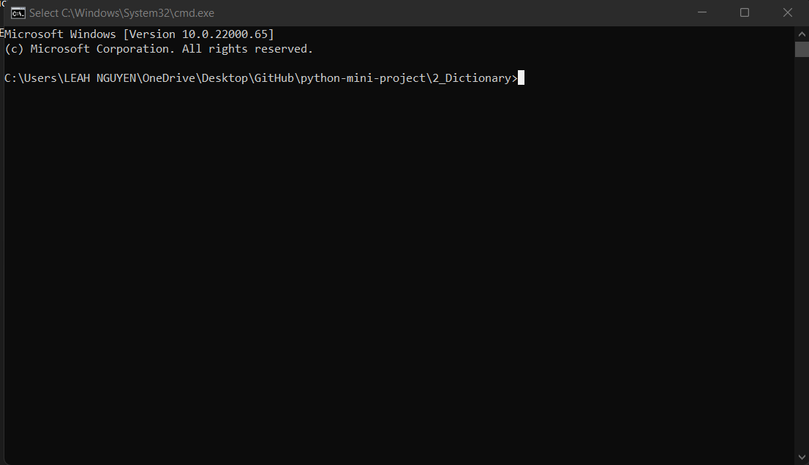

# Dictionary
<p align="center">


## 🛠️ Description

A dictionary stimulator by Python in which you can enter any words and you will get the definition of it as the output.

## ⚙️ Languages or Frameworks Used
You only need Python to run this script. You can visit [here](https://www.python.org/downloads/) to download Python.

## 🌟 How to run

Running the script is really simple! Just open a terminal in the folder where your script is located and run the following command:

```sh
python dictionary.py
```

## 📺 Demo
<p align="center">

